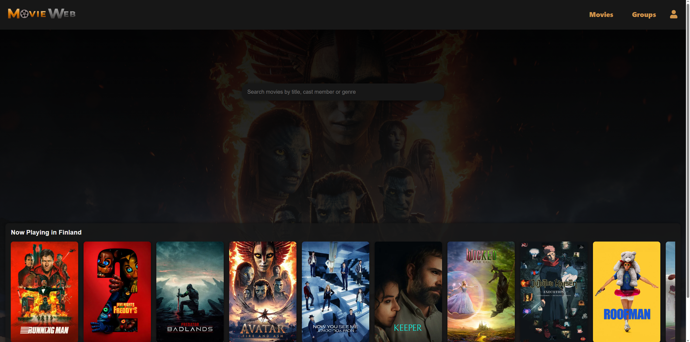

# Movie Web Application

## Projekti
Tämä on kouluprojekti, jonka tavoitteena oli oppia **fullstack-kehitystä** käyttäen **Reactia**, **Node.js/Expressiä**, **JavaScriptiä** ja **PostgreSQL:ää**. Projekti toimii harjoituksena modernin web-sovelluksen rakentamisesta, tietokannan hallinnasta sekä kolmannen osapuolen API:n integroinnista. Projektiin kuului myös omien REST rajapintojen implementointi. Testaukseen ja dokumentointiin käytettiin **Postman**. Kehityksessä tehtiin myös yksikkötestejä muutamille rajapinnoille käyttäen **Jest/Supertest**

## Sovelluksen kuvaus
Movie Web App on elokuvasivusto, jossa käyttäjät voivat:

- **Etsiä elokuvia** TMDB:n (The Movie Database) API:n avulla.
- **Rekisteröityä** ja luoda oman käyttäjätilin.
- **Antaa arvosteluja** elokuville.
- **Lisätä elokuvia suosikkeihin**.
- **Luoda ryhmiä**, joihin voi postata elokuvia ja kommentoida muiden julkaisuja.

Sovellus yhdistää frontendin ja backendin saumattomasti, tarjoten interaktiivisen ja käyttäjäystävällisen kokemuksen elokuvien ystäville.

## Teknologiat
- **Frontend:** React, JavaScript  
- **Backend:** Node.js, Express  
- **Tietokanta:** PostgreSQL  
- **API:** TMDB API elokuvien hakemiseen
- **Yksikkötestit:** Jest, Supertest

