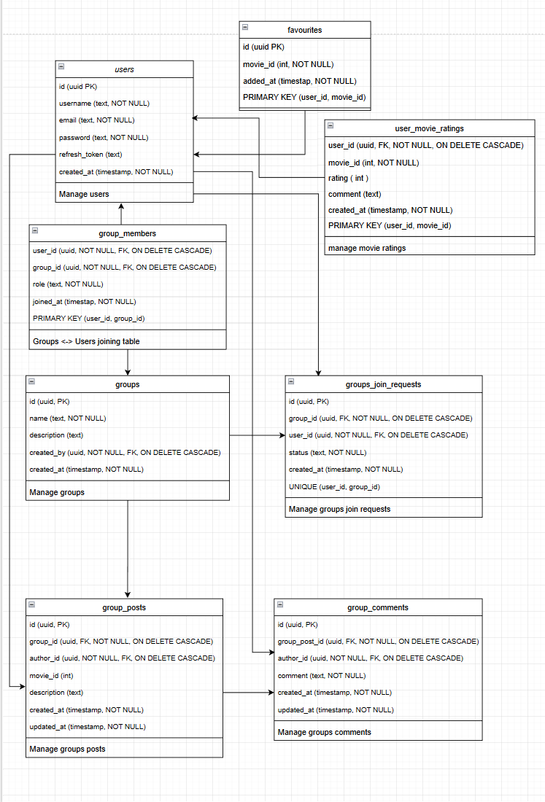
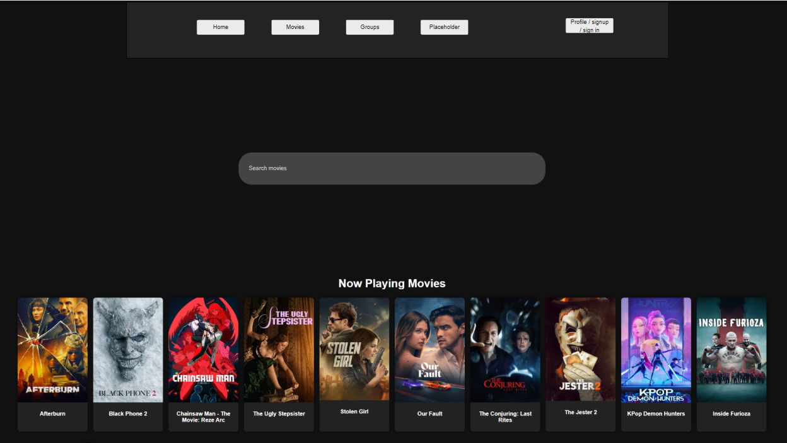

# Projektin dokumentaatio

## Luokkakaavio tietokannasta

Tässä on projektin lopullinen tietokantakaavio. Se kuvaa tietokannan taulut ja niiden väliset suhteet. Alusta kaavio on myös saatavilla.

## Käyttöliittymäsuunnitelma

Alustavan käyttöliittymä suunnitelman ensimmäinen versio. Koko käyttöliittymäsuunnitelman voi tarkastaa täältä: [Käyttöliittymä suunnitelma](https://app.moqups.com/VE8o6p1VkqiQnMCTqAuJwyZJoJ2j1tl5/view/page/ad64222d5)

## REST-dokumentaatio

Projektimme rest dokumentaatio on tehty Postmanilla. Se löytyy kokonaisuudessaan täältä. Pyydettyihin endpointteihin on panostettu. <Linkki>

## Kehitysjonon hallinta

Kehitysjonon hallinta löytyy projektimme githubista: [Project Board](https://github.com/users/jimmb5/projects/2/views/9)
